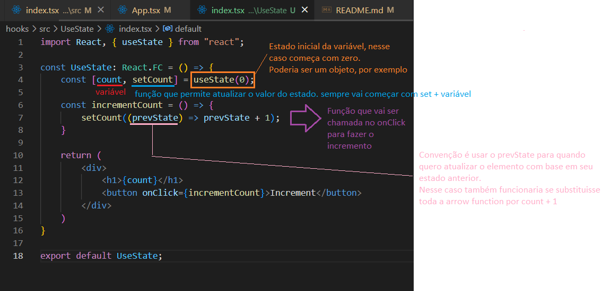

# Notas de aula e exemplos de aplicação dos Hooks

## O que são?

<ul>
    <li>API do React (a partir da versão 16.8);</li>
    <li>Permite usar state e outros recursos do React sem precisar de uma classe;</li>
    <li>Só é possível utilizar dentro de componentes funcionais;</li>
    <li>Facilita a sintax do componente --> ficando menos verbosa;</li>
    <li>Com a criação dos hooks não há mais a necessidade de usar as classes;</li>
    <li>Não colocar o Hooks dentro de uma função ou dentro de um if, pois a quantidade de vezes que ele vai ser chamado pode ser diferente;</li>
    <li>São exemplos de hooks:
        <ol>
            <li>useState</li>
            <li>useEffect</li>
            <li>useRef</li>
            <li>useReducer</li>
            <li>useContext</li>
            <li>useMemo</li>
            <li>useCallback</li>
            <li>useLayoutEffect</li>
        </ol>
    </li>
</ul>

## React Hooks

Principais Hooks:

### useState

<ul>
    <li>Forma de armazenar states nos componentes funcionais;</li>
    <li>Usado quando o estado de um componente se altera;</li>
</ul>

