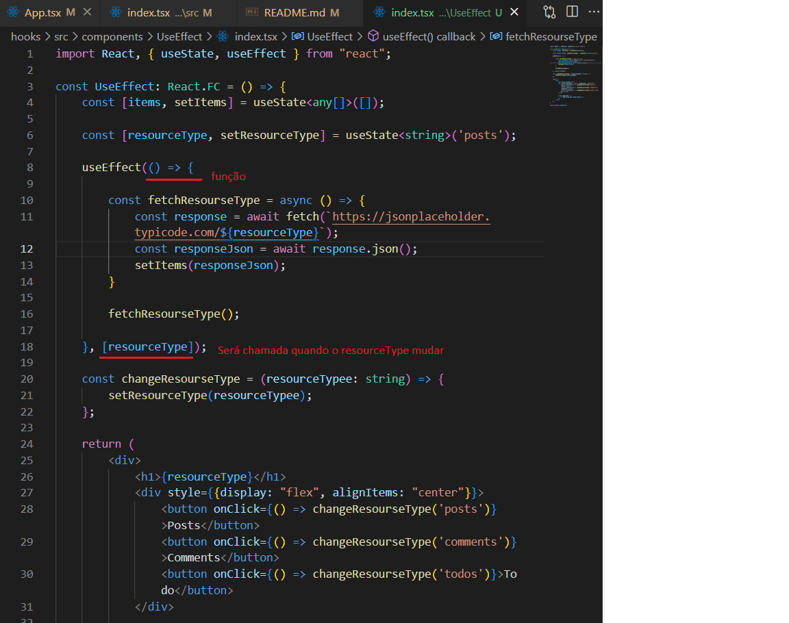

# Notas de aula e exemplos de aplicação dos Hooks

## O que são?

- API do React (a partir da versão 16.8);
- Permite usar state e outros recursos do React sem precisar de uma classe;
- Só é possível utilizar dentro de componentes funcionais;
- Facilita a sintax do componente --> ficando menos verbosa;
- Com a criação dos hooks não há mais a necessidade de usar as classes;
- Não colocar o Hooks dentro de uma função ou dentro de um if, pois a quantidade de vezes que ele vai ser chamado pode ser diferente;
- São exemplos de hooks:
    - useState
    - useEffect
    - useRef
    - useReducer
    - useContext
    - useMemo
    - useCallback
    - useLayoutEffect

## React Hooks

Principais Hooks:

### useState

- Forma de armazenar states nos componentes funcionais;
- Usado quando o estado de um componente se altera.

### useEffect

- Um dos hooks mais importantes;
- Geralmente usados quando se consome dadoss de uma API;
- Dá acesso aos métodos de ciclo de vida do componente;
- "Fazer alguma coisa quando algo mudar"
- Não pode ser uma função assíncrona;
- Para usar assíncrono no useEffect tem que criar uma função assíncrona.

Construção:

- Recebe 2 parâmetros: primeiro é uma função e o segundo é o array de dependências;
- O segundo parâmetro não é obrigatório, mas sempre será executado sempre que o componente for renderizado novamente;
- O segundo parâmetro deve receber o elemento que eu quero "assistir". No exemplo, o resourseType é passado no segundo parâmetro, pois quero "fazer alguma coisa" quando esse componente mudar;

### useRef

- Retorna um objeto ref mutável, no qual a propriedade .current é inicializada;
- Guardar quantas vezes o componente foi renderizado (Exemplo 1);
- Dá para utilizar para referenciar elementos HTML (Exemplo 2)

### useMemo

